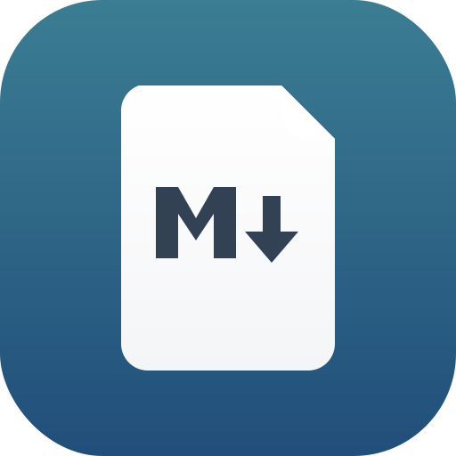

# Markdown for Mac

A clean, native markdown viewer for macOS built with Electron.



## Features

- **GitHub-Flavored Markdown** — full GFM support including tables, task lists, and strikethrough
- **Syntax Highlighting** — 190+ languages powered by highlight.js
- **Table of Contents** — auto-generated sidebar with scroll-spy highlighting
- **Folder Browser** — open a folder and navigate all `.md` files from the sidebar
- **Find in Document** — native find bar with next/previous navigation (⌘F)
- **Zoom** — adjustable font size (⌘+ / ⌘− / ⌘0)
- **Export to PDF** — print-ready PDF export (⌘⇧E)
- **Dark & Light Mode** — follows system preference automatically
- **Drag & Drop** — drop any `.md` file directly onto the window
- **Recent Files** — quick access to previously opened files
- **File Associations** — set as default app to open `.md` files from Finder

## Installation

### Option 1 — Build from source

```bash
git clone https://github.com/yourusername/markdown-for-mac.git
cd markdown-for-mac
npm install
npm run build
```

Then drag `dist/mac-arm64/Markdown for Mac.app` into your `/Applications` folder.

### Option 2 — Homebrew (personal tap)

```bash
brew tap yourusername/tap
brew install --cask markdown-for-mac
```

### Option 3 — Run in development mode

```bash
npm install
npm start
```

## Usage

| Action | Shortcut |
|---|---|
| Open file | ⌘O |
| Open folder | ⌘⇧O |
| Toggle sidebar | ⌘\ |
| Find in document | ⌘F |
| Zoom in / out / reset | ⌘+ / ⌘− / ⌘0 |
| Export to PDF | ⌘⇧E |
| Print | ⌘P |

### Set as default for `.md` files

1. Right-click any `.md` file in Finder
2. **Get Info** (⌘I)
3. Under **Open With**, select **Markdown for Mac**
4. Click **Change All…**

## Development

### Requirements

- macOS 12 or later
- Node.js 18 or later

### Project structure

```
markdown_for_mac/
├── main.js              # Electron main process
├── preload.js           # Secure contextBridge API
├── src/
│   ├── index.html       # App UI layout
│   ├── renderer.js      # Frontend logic
│   └── styles.css       # Styles (dark + light mode)
├── assets/
│   ├── icon.svg         # Source icon
│   └── icon.icns        # macOS icon bundle
└── scripts/
    ├── create-icon.sh           # Regenerates icon.icns from icon.svg
    └── homebrew-formula-template.rb  # Brew Cask formula template
```

### Rebuild the app icon

```bash
bash scripts/create-icon.sh
```

### Build a distributable `.app`

```bash
npm run build   # outputs to dist/mac-arm64/
```

### Build a `.dmg` installer

```bash
npm run dist    # outputs dist/Markdown for Mac-x.x.x.dmg
```

## Tech stack

| Library | Purpose |
|---|---|
| [Electron](https://electronjs.org) v28 | App framework |
| [marked](https://marked.js.org) v4 | Markdown parser |
| [highlight.js](https://highlightjs.org) v11 | Syntax highlighting |
| [github-markdown-css](https://github.com/sindresorhus/github-markdown-css) v5 | Markdown body styles |
| [electron-builder](https://www.electron.build) v24 | Packaging & distribution |

## Author

**Albert Garcia Diaz** — created March 2026

## License

MIT
